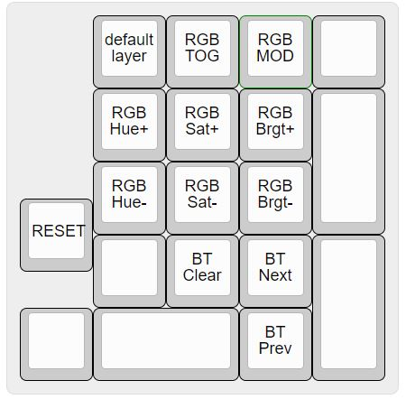

## ZMK Firmware adapted for duckboard/nice!nano combo

Last Updated: 19 April 2021

**_Notice:_** This firmware has been tested and validated, but continues to be updated on a regular basis. If you encounter any issues, please message me on [discord](https://discord.gg/K3SJrtN5PJ) to report any bugs.  

**_note on OLED support:_** ZMK firmware documentation is still in progress, and as of now does not provide any guidance for programming OLEDs. By default on this firmware, the OLED is enabled and will show the status of the battery, BT connectivity, and USB connectivity. Once the ZMK firmware is updated to include descriptions on how to edit the OLED readout, the firmware will be updated to have the same default readout as the QMK default firmware.

Credit for the ZMK Firmware to [The ZMK Contributors](https://zmkfirmware.dev/)  
Hardware credit for the duckboard to [doodboard](https://doodboard.xyz/)  
Hardware credit for the nice!nano to Nicell of [nice keyboards](https://nicekeyboards.com/)   
Developed with the help of [Hector Barnett](https://discordapp.com/users/305794398476828674)   

Join the [ZMK Discord Server](https://zmkfirmware.dev/community/discord/invite) and the [doodboard Discord Server](https://discord.gg/UCEnxWk)

Flashing Instructions:
* download the duckboard.uf2 file
* connect the nice!nano to your computer and put it in bootloader mode (short gnd+rst twice)
* once in bootloader mode, the n!n should appear as a storage device on your computer
* drag the duckboard.uf2 file into the n!n storage and it should flash automatically

further flashing instructions in the [nice!nano docs](https://docs.nicekeyboards.com/#/nice!nano/getting_started?id=flashing-firmware-and-bootloaders) 

*Default Layout:*

| Layer 0 (Default) | Layer 1 (Function) | Layer 2 (RGB and BT) |
  ------  | ------ | ------
  |  | 
